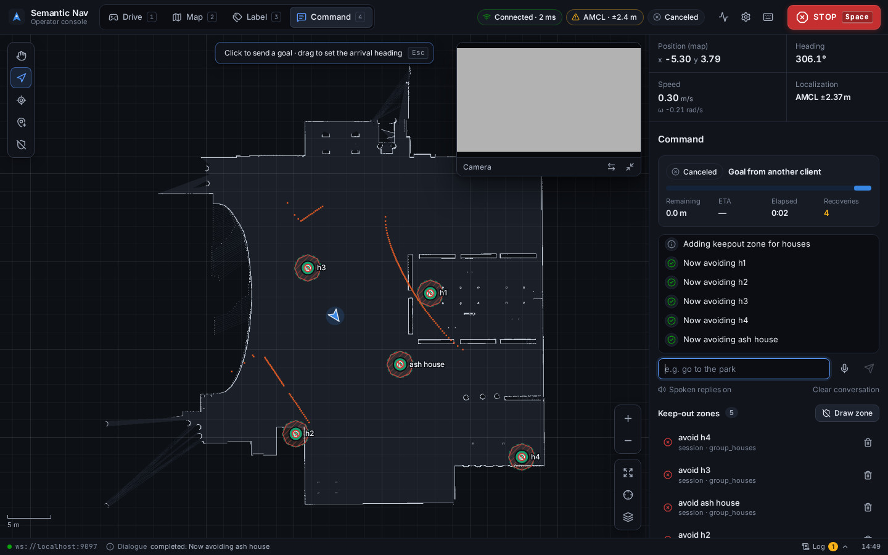
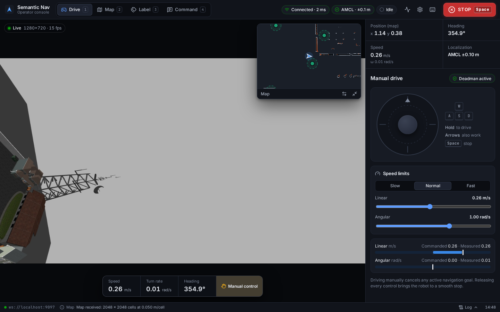
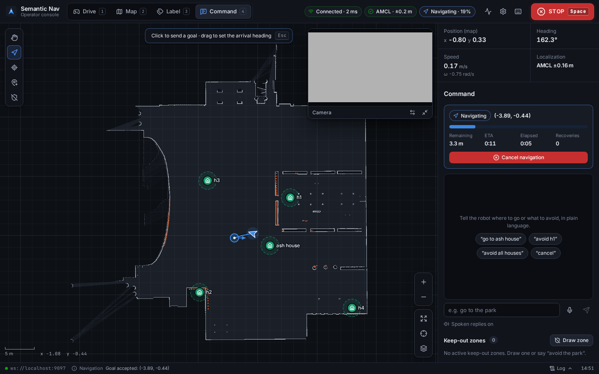
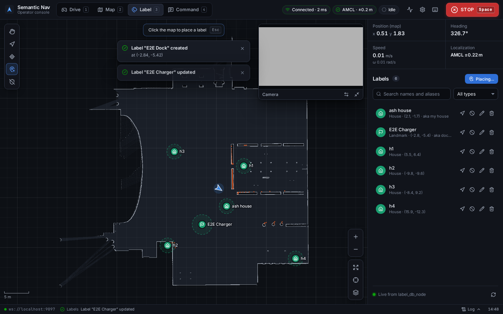
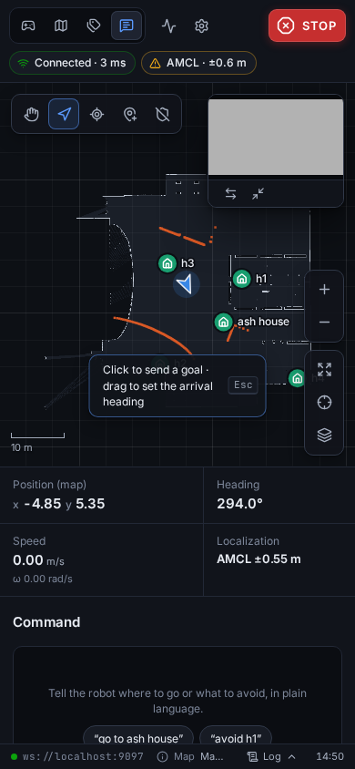

# Semantic Nav — Operator Console

Web operator console for the Semantic Keep-Out Navigation robot (ROS 2 Humble). Drive the robot, build and
save maps, label places, and command it in plain language — with live camera, map, laser, path and
keep-out zones — from any browser on the robot's network. No installs on the operator's device, works offline.



## Highlights

- **Four modes, one screen** — Drive · Map · Label · Command, each with the right view (camera or map)
  in front and the other as picture-in-picture. Drag the picture-in-picture anywhere, resize it from its
  corner, click it to swap. The camera can be zoomed (wheel, pinch, + / −) and dragged around.
- **Live 2D map** — occupancy grid, robot footprint from TF, laser returns, Nav2's planned path, goal marker,
  labelled places and hatched keep-out zones. Pan, zoom, pinch, follow robot, layers.
- **Map tools** — click-and-drag navigation goals with heading, AMCL pose estimate, place labels, draw keep-out
  polygons. Selecting a place gives Go here / Avoid / Edit / Delete.
- **Natural-language commands** — text or voice ("go to the park", "avoid all houses"), with the robot's
  follow-up questions shown as clickable answers and spoken aloud.
- **Navigation status for every goal** — progress, distance remaining, ETA, recoveries and Cancel, whether
  the goal came from this console, a voice command, the executor or RViz.
- **Safety built in** — always-visible STOP (Space), hold-to-drive teleop with smooth acceleration limits,
  manual override of autonomy, and a deadman guard on the robot that stops the base if the browser goes away.
- **System health** — link round-trip time, node presence by subsystem, per-topic rates and ages, TF freshness,
  and an event log of everything that happened.

| Drive | Command |
|---|---|
|  |  |
| **Label** | **Phone** |
|  |  |

## Quick start

### On the robot (production)

```bash
# once, and after pulling changes
cd ~/dev_ws/src/semantic_nav_hmi
npm install
npm run build                      # → dist/, served by hmi_server_node

cd ~/dev_ws
colcon build --symlink-install --packages-select semantic_nav_interfaces semantic_keepout_layer semantic_nav_bringup
source install/setup.bash
ros2 launch semantic_nav_bringup semantic_nav.launch.py        # add slam:=True to build a new map
```

Open **http://localhost:8080** (or `http://<robot-ip>:8080` from a laptop or tablet on the same network).
The launch starts rosbridge (9090), rosapi, the teleop guard and the console server alongside the robot stack.
Useful arguments: `slam:=True`, `use_rviz:=False`, `headless:=True` (no Gazebo window), `hmi_port:=`, `rosbridge_port:=`.

### Developing the console

```bash
cd ~/dev_ws/src/semantic_nav_hmi
npm run dev          # http://localhost:5173 with hot reload; connects to ws://<this host>:9090
npm test             # unit tests (vitest)
npm run typecheck
```

`?ws=ws://other-host:9090` in the page address overrides the rosbridge URL for that session.

## Using the console

| Mode | Main view | What you do there |
|---|---|---|
| **Drive** `1` | Camera (map in PiP) | Joystick or WASD/arrows, speed limits, commanded vs measured velocity |
| **Map** `2` | Map | SLAM status, map statistics, save the map (pose graph + occupancy grid) |
| **Label** `3` | Map | Click the map to add a place; search, filter, edit, delete; Go / Avoid per label |
| **Command** `4` | Map | Type or speak commands, answer questions, follow navigation, manage keep-out zones |

Map tools (left palette): **V** select & pan · **G** goal (drag sets heading) · **P** pose estimate ·
**L** place label · **K** keep-out polygon (Enter or click the first corner to finish, Backspace undo, Esc cancel).
Map controls (right): zoom, **0** fit, **F** follow robot, layers.

### Keyboard shortcuts

| Key | Action |
|---|---|
| `Space` | **STOP** — cancel all navigation goals and zero velocity (works unless you're typing in a non-empty field) |
| `1`–`4` | Drive · Map · Label · Command |
| `W A S D` / arrows | Drive (Drive and Map modes); release to stop |
| `C` | Swap camera and map |
| `+` `−` `0` | Zoom in / out / reset the view in front (map or camera) |
| `/` · `M` | Focus the command box · speak a command |
| `?` | All shortcuts |

## Safety model

STOP is a **software stop**, not a safety-rated emergency stop — keep a hardware e-stop on real robots.

- Teleop publishes only while you are actively driving, plus one final zero, so Nav2 keeps ownership of
  `/cmd_vel` the rest of the time. Starting to drive cancels any active navigation goal (manual override).
- Losing focus (switching windows, hiding the tab, closing the page) releases every key and the joystick.
- The browser publishes to `/hmi/cmd_vel`; **`teleop_guard`** forwards it to `/cmd_vel`, clamps it to safe
  limits, and publishes a zero if the stream stops for 0.5 s — a crashed browser or dropped Wi-Fi can't leave the
  robot driving. The Drive panel shows whether the guard is running.
- Nothing is queued while disconnected: commands made offline fail visibly instead of firing on reconnect.

## How it talks to ROS

Everything goes through rosbridge 2.x over one WebSocket (roslibjs 2, bundled).

| Purpose | Interface | Notes |
|---|---|---|
| Robot pose | `/tf`, `/tf_static` | In-browser TF tree: `map → odom → base_footprint` (falls back to odom if not localized) |
| Map | `/map` (OccupancyGrid) | CBOR binary, latched QoS; JSON fallback if rosbridge can't send it as one message |
| Camera | `/chase_camera/image_raw/compressed` | CBOR, ≤15 fps, freshest frame only, decoded off the main thread |
| Laser, path, velocity | `/scan`, `/plan`, `/odometry/filtered` | Throttled; laser transformed into the map frame |
| Localization quality | `/amcl_pose` | Covariance → ± position uncertainty |
| Navigation | `/navigate_to_pose` action, `…/_action/status`, `…/_action/feedback`, `…/_action/cancel_goal` | Goals from any client are shown; STOP cancels all |
| Pose estimate | `/initialpose` | |
| Teleop | `/hmi/cmd_vel` → `teleop_guard` → `/cmd_vel` | Configurable in Settings |
| Labels | `/label_list` (latched snapshot), `/add_label`, `/update_label`, `/remove_label`, `/get_labels` | |
| Keep-out zones | `/keepout_zone_list` (latched snapshot), `/add_keepout_zone`, `/remove_keepout_zone` | Zones created from a label use the same group id as voice commands |
| Commands & dialogue | `/voice_command`, `/dialogue_response`, `/dialogue_events` | No-reply detection after 10 s |
| Map saving | `/slam_toolbox/serialize_map`, `/map_saver/save_map` | Needs `slam:=True` |
| Health | `/rosapi/nodes`, loopback `/hmi/ping` | Node presence; true round-trip time |

## Code layout

```
src/
  ros/         bridge.ts (connection, subscriptions, services, actions), app.ts (all wiring and operator
               commands), teleop.ts, tf.ts, navstate.ts, names.ts, types.ts
  map/         MapView.tsx (interaction), renderer.ts (canvas drawing), viewport.ts, occupancy.ts
  camera/      CameraView.tsx
  components/  TopBar, Stage, SidePanel, panels/, dialogs/, ui/ primitives
  state/       store.ts (zustand app state), live.ts (high-rate data, bypasses React), settings.ts
  styles/      tokens.css (design tokens), base.css, app.css
  test/        unit tests
```

High-rate data (TF, map pixels, laser, camera frames) never goes through React: canvases redraw on demand,
so an idle console uses almost no CPU. Colour roles on the map (blue = robot/path, aqua = places,
orange = laser, red hatched = keep-out) were validated for colour-vision deficiencies; status is always shown
as icon + text, never colour alone.

## Configuration

Settings (gear icon) are stored per browser: rosbridge URL, topic names, frame names, robot footprint, spoken
replies. When served by `hmi_server_node`, the console reads `/hmi-config.json` to learn the rosbridge port.

## Troubleshooting

| Symptom | Cause / fix |
|---|---|
| Top bar says *Offline · retrying* | rosbridge isn't reachable — is the launch running? Is port 9090 open? Check the URL in Settings. |
| No map | Nothing publishes `/map` yet (start SLAM or the map server). A large map on an external rosbridge needs `max_message_size ≥ 20000000` (the launch sets it). |
| *Guard offline* in Drive | `teleop_guard` isn't running; start the full launch or set the teleop topic to `/cmd_vel`. |
| Commands get *No response from the command pipeline* | `intent_parser_node`, `target_resolver_node` or `dialogue_manager_node` isn't running (System panel). |
| Voice button disabled | Voice input needs Chrome/Edge on `localhost` or HTTPS. Typed commands always work. |
| Saving the pose graph fails | slam_toolbox writes under `$SNAP_COMMON` when it is set; the launch file unsets it. |
